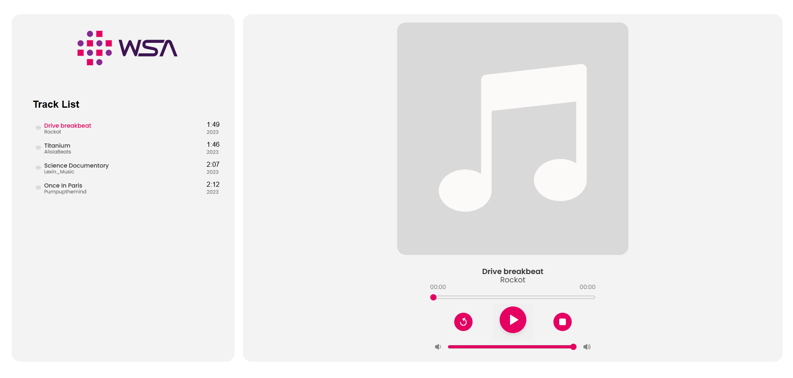

# 🎵 Music Player – Level 1

This project is a **basic web-based Music Player** that allows users to play, stop, and restart audio files from a preloaded list. It provides essential music playback controls through a clean and interactive user interface.

## ✨ Features

- 🎧 List of selectable audio tracks  
- ▶️ Play music  
- ⏹️ Stop playback  
- 🔁 Restart track  
- 🎨 Simple and clean UI for basic user interaction

## 🚀 Live Demo

## 🖼️ Preview

## 💡 Guidance

- Build a simple HTML layout with a list of audio tracks and control buttons.
- Style the player with CSS for a pleasing look.
- Use JavaScript to:
  - Play selected audio
  - Stop the audio
  - Restart audio from the beginning
- Ensure proper testing for smooth playback across browsers.

## 🛠️ Tech Stack

- **HTML**
- **CSS**
- **Vanilla JavaScript**

## 📁 Project Structure

<pre>
music-player/
│
├── css/
│   └── style.css           # Styles for music player UI
│
├── javascript/
│   └── script.js           # JavaScript for play, stop, and restart functionality
│
└── index.html              # HTML structure of the calculator
</pre>

## 📄 License

MIT License

Copyright (c) 2025 Tejas

Open source under the 
